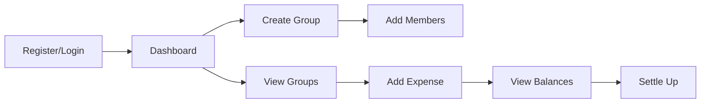
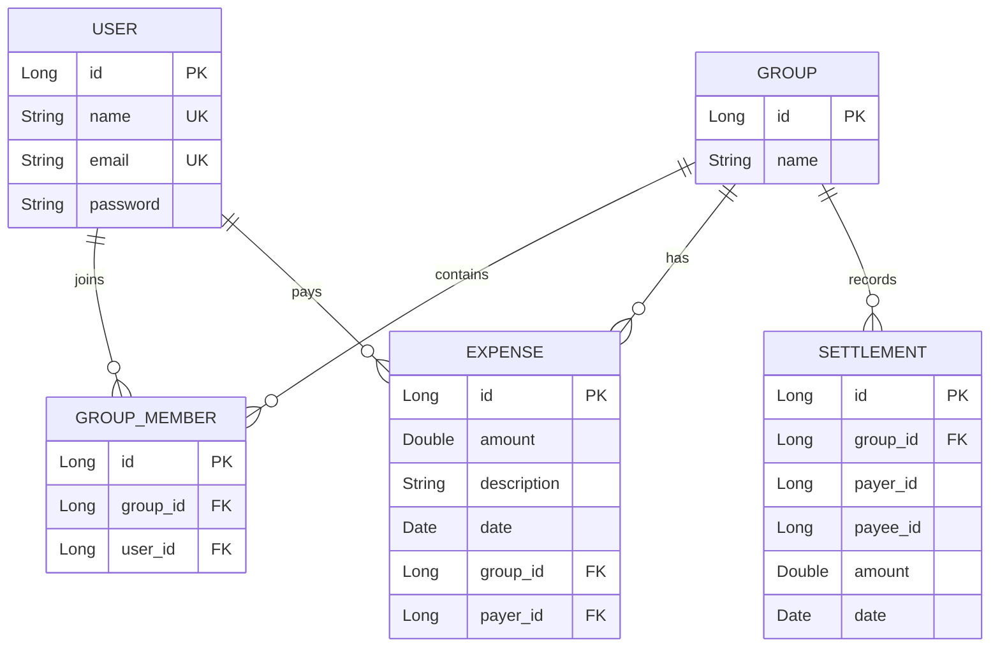

# 💰 Splitwise - Expense Sharing Web Application
> ⚠️ **Note**: This repository contains the initial version of the Splitwise Expense Sharing Web Application.
> A newer, deployed version with updated tech stack and improvements is available here:  
> 👉 [Updated Repository](https://github.com/Achal13jain/Splitwise_web_app)  
> 👉 [Live Deployment](https://msplitwise.netlify.app/) 

<div align="center">
  
  
  
  
  
  **A modern expense sharing application that helps groups split bills and track shared expenses effortlessly**
  
  [Features](#-features) • [Tech Stack](#%EF%B8%8F-tech-stack) • [API Documentation](#-api-documentation) • [Contributing](#-contributing)
  
</div>

---

## 📋 Table of Contents

- [Overview](#-overview)
- [Features](#-features)
- [Tech Stack](#%EF%B8%8F-tech-stack)
- [Architecture](#%EF%B8%8F-architecture)
- [Prerequisites](#-prerequisites)
- [Installation](#-installation)
- [Configuration](#%EF%B8%8F-configuration)
- [Usage](#-usage)
- [API Documentation](#-api-documentation)
- [Project Structure](#-project-structure)
- [Database Schema](#%EF%B8%8F-database-schema)
- [Contributing](#-contributing)
- [Testing](#-testing)
- [Deployment](#-deployment)
- [Troubleshooting](#-troubleshooting)

## 🎯 Overview

Splitwise is a full-stack web application designed to simplify expense sharing among groups. Whether you're splitting bills with roommates, organizing group trips, or managing shared expenses with friends, Splitwise helps you track who owes what and settle up easily.

### Why Splitwise?

- **No more IOUs**: Keep track of shared expenses and balances
- **Fair splitting**: Automatically calculates each person's share
- **Group management**: Organize expenses by different groups
- **Settlement tracking**: Record when debts are settled
- **Transaction history**: View all past expenses and settlements

## ✨ Features

### Core Functionality
- 🔐 **User Authentication**: Secure registration and login with encrypted passwords
- 👥 **Group Management**: Create and manage expense groups
- 💸 **Expense Tracking**: Add expenses and automatically split among group members
- ⚖️ **Balance Calculation**: Real-time calculation of who owes whom
- 🤝 **Settlement Recording**: Track when debts are paid off
- 📊 **Transaction History**: View complete history of expenses and settlements

### User Features
- Create and join multiple expense groups
- Add expenses with descriptions and amounts
- View individual balances within each group
- Settle up with specific group members
- View personal transaction history
- User profile management

## 🛠️ Tech Stack

### Backend
- **Framework**: Spring Boot 3.2.2
- **Language**: Java 16+
- **Database**: PostgreSQL
- **ORM**: Spring Data JPA / Hibernate
- **Security**: Spring Security (BCrypt password encryption)
- **Build Tool**: Maven

### Frontend
- **HTML5** & **CSS3**
- **JavaScript** (Vanilla)
- **Font**: Google Fonts (Montserrat)
- **Architecture**: Single Page Application (SPA) pattern

### Development Tools
- **IDE**: IntelliJ IDEA (recommended)
- **API Testing**: Postman
- **Version Control**: Git

## 🏗️ Architecture

The application follows a **layered architecture** pattern:

```
┌─────────────────────────────────────────────────────────┐
│                     Frontend (HTML/JS)                  │
├─────────────────────────────────────────────────────────┤
│                   REST API (Controllers)                │
├─────────────────────────────────────────────────────────┤
│                  Business Logic (Services)              │
├─────────────────────────────────────────────────────────┤
│                Data Access Layer (Repositories)         │
├─────────────────────────────────────────────────────────┤
│                    Database (PostgreSQL)                │
└─────────────────────────────────────────────────────────┘
```

### Key Design Patterns
- **MVC Pattern**: Model-View-Controller architecture
- **DTO Pattern**: Data Transfer Objects for API communication
- **Repository Pattern**: Abstraction over data persistence
- **Service Layer Pattern**: Business logic separation

## 📦 Prerequisites

Before you begin, ensure you have the following installed:

- **Java Development Kit (JDK)** 16 or higher
  ```bash
  java -version
  ```
- **Maven** 3.6 or higher
  ```bash
  mvn -version
  ```
- **PostgreSQL** 13 or higher
  ```bash
  psql --version
  ```
- **Git**
  ```bash
  git --version
  ```

## 🚀 Installation

### 1. Clone the Repository

```bash
git clone https://github.com/Achal13jain/Splitwise_app.git
cd Splitwise_app
```

### 2. Set Up PostgreSQL Database

```sql
-- Connect to PostgreSQL
psql -U postgres

-- Create database
CREATE DATABASE splitwise;

-- Create user (optional)
CREATE USER splitwise_user WITH PASSWORD 'your_password';
GRANT ALL PRIVILEGES ON DATABASE splitwise TO splitwise_user;
```

### 3. Configure Application Properties

Navigate to `splitwise-backend/src/main/resources/application.properties` and update:

```properties
spring.datasource.url=jdbc:postgresql://localhost:5432/splitwise
spring.datasource.username=your_username
spring.datasource.password=your_password
spring.jpa.hibernate.ddl-auto=update
spring.jpa.show-sql=true
spring.jpa.properties.hibernate.format_sql=true
```

### 4. Build and Run the Backend

```bash
cd splitwise-backend
mvn clean install
mvn spring-boot:run
```

The backend will start on `http://localhost:8080`

### 5. Launch the Frontend

Open `splitwise-app-frontend/splitwise-app-ui/home.html` in your browser or use a local server:

```bash
cd splitwise-app-frontend/splitwise-app-ui
# Using Python
python -m http.server 5500
# Or using Node.js
npx http-server -p 5500
```

Access the application at `http://localhost:5500/home.html`

## ⚙️ Configuration

### Environment Variables

Create a `.env` file in the root directory (optional):

```env
DB_HOST=localhost
DB_PORT=5432
DB_NAME=splitwise
DB_USER=postgres
DB_PASSWORD=your_password
SERVER_PORT=8080
```

### CORS Configuration

CORS is configured in `WebConfig.java`. Update the allowed origins if deploying:

```java
.allowedOrigins("http://127.0.0.1:5500", "https://yourdomain.com")
```

## 📱 Usage

### Getting Started

1. **Register**: Create a new account on the signup page
2. **Login**: Use your credentials to access the dashboard
3. **Create Group**: Start a new expense group and add members
4. **Add Expenses**: Record shared expenses in your groups
5. **View Balances**: Check who owes what in each group
6. **Settle Up**: Record payments when debts are settled

### User Flow



## 📚 API Documentation

### Authentication Endpoints

| Method | Endpoint | Description | Request Body |
|--------|----------|-------------|--------------|
| POST | `/api/users/register` | Register new user | `{name, email, password}` |
| POST | `/api/users/login` | User login | `{email, password}` |
| GET | `/api/users/email/{email}` | Get user by email | - |

### Group Management

| Method | Endpoint | Description | Request Body |
|--------|----------|-------------|--------------|
| POST | `/api/groups/create-with-members` | Create group with members | `{name, userId, memberUsernames[]}` |
| GET | `/api/groups/user/email/{email}` | Get user's groups | - |
| GET | `/api/groups/{id}/details` | Get group details | Query: `userId` |

### Expense Management

| Method | Endpoint | Description | Request Body |
|--------|----------|-------------|--------------|
| POST | `/api/expenses/add` | Add expense | `{groupId, description, amount, payerId}` |
| POST | `/api/settle` | Settle up | `{payerId, payeeId, groupId}` |
| GET | `/api/users/{userId}/transactions` | Get user transactions | - |

### Response Examples

<details>
<summary>Group Details Response</summary>

```json
{
  "groupId": 1,
  "name": "Goa Trip",
  "members": [
    {"id": 1, "name": "John", "email": "john@example.com"},
    {"id": 2, "name": "Jane", "email": "jane@example.com"}
  ],
  "expenses": [
    {
      "id": 1,
      "description": "Hotel",
      "amount": 5000.00,
      "payerName": "John",
      "date": "2024-01-15"
    }
  ],
  "balances": [
    "You owe Jane ₹2500.00"
  ],
  "isSettled": false
}
```

</details>

## 📁 Project Structure

```
splitwise/
├── 📂 splitwise-backend/
│   ├── 📂 src/main/java/com/splitwise/
│   │   ├── 📂 config/          # Spring configuration
│   │   │   ├── SecurityConfig.java
│   │   │   └── WebConfig.java
│   │   ├── 📂 controller/      # REST controllers
│   │   │   ├── UserController.java
│   │   │   ├── GroupController.java
│   │   │   └── ExpenseController.java
│   │   ├── 📂 dto/             # Data Transfer Objects
│   │   ├── 📂 model/           # Entity classes
│   │   ├── 📂 repository/      # Data access layer
│   │   ├── 📂 service/         # Business logic
│   │   └── SplitwiseApplication.java
│   ├── 📂 src/main/resources/
│   │   └── application.properties
│   └── pom.xml
├── 📂 splitwise-app-frontend/
│   └── 📂 splitwise-app-ui/
│       ├── 📂 css/             # Stylesheets
│       ├── 📂 js/              # JavaScript files
│       ├── index.html          # Login/Register
│       ├── dashboard.html      # Main dashboard
│       ├── group.html          # Group details
│       └── add-expense.html    # Add expense form
├── .gitignore
└── README.md
```

## 🗄️ Database Schema

### Entity Relationship Diagram



## 🤝 Contributing

We welcome contributions! Please follow these steps:

1. **Fork** the repository
2. **Create** a feature branch
   ```bash
   git checkout -b feature/AmazingFeature
   ```
3. **Commit** your changes
   ```bash
   git commit -m 'Add some AmazingFeature'
   ```
4. **Push** to the branch
   ```bash
   git push origin feature/AmazingFeature
   ```
5. **Open** a Pull Request

### Coding Standards

- Follow Java naming conventions
- Write meaningful commit messages
- Add comments for complex logic
- Update tests for new features
- Ensure no build warnings

## 🧪 Testing

### Running Tests

```bash
# Run all tests
mvn test

# Run specific test class
mvn test -Dtest=UserServiceTest

# Run with coverage
mvn clean test jacoco:report
```

### Manual Testing

1. Use Postman collection 
2. Test user flows through UI
3. Verify database state

## 🚢 Deployment

### Docker Deployment

```dockerfile
# Dockerfile (to be added)
FROM openjdk:16-jdk-alpine
COPY target/splitwise-backend.jar app.jar
ENTRYPOINT ["java", "-jar", "/app.jar"]
```

### Production Considerations

- [ ] Enable HTTPS
- [ ] Configure production database
- [ ] Set up monitoring (e.g., Actuator)
- [ ] Implement rate limiting
- [ ] Add logging aggregation
- [ ] Configure backup strategy

## 🔧 Troubleshooting

### Common Issues

<details>
<summary>Database Connection Failed</summary>

- Verify PostgreSQL is running: `sudo service postgresql status`
- Check credentials in `application.properties`
- Ensure database exists: `psql -U postgres -l`

</details>

<details>
<summary>CORS Errors</summary>

- Update `WebConfig.java` with correct frontend URL
- Ensure frontend is served from expected port

</details>

<details>
<summary>Build Failures</summary>

- Clear Maven cache: `mvn clean`
- Update dependencies: `mvn dependency:resolve`
- Check Java version compatibility

</details>


## 👤 Author

**Achal Jain**

- GitHub: [@Achal13jain](https://github.com/Achal13jain)
- Repository: [Splitwise_app](https://github.com/Achal13jain/Splitwise_app)

---


<div align="center">


[⬆ Back to top](#-splitwise---expense-sharing-web-application)

</div>   
